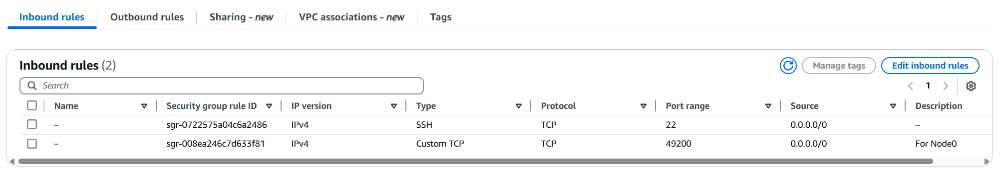
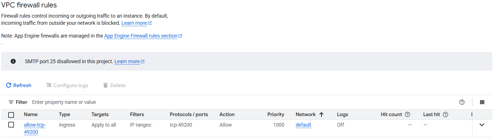
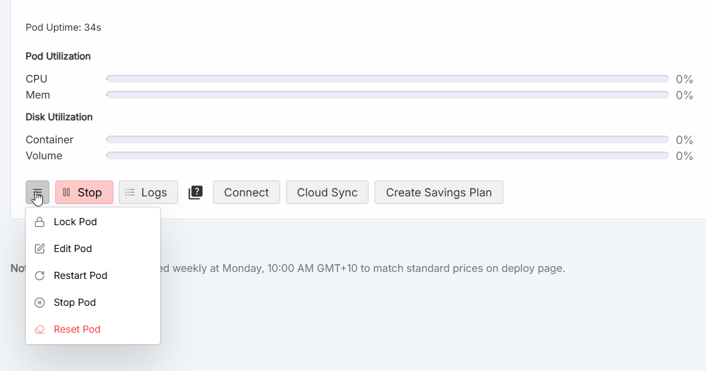
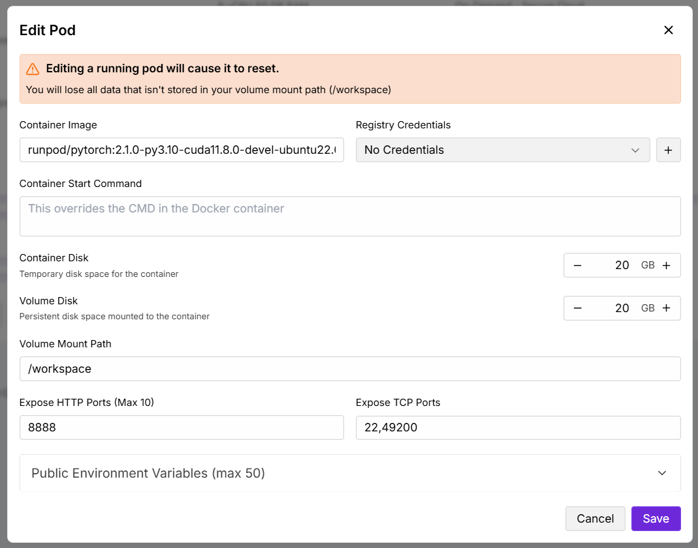
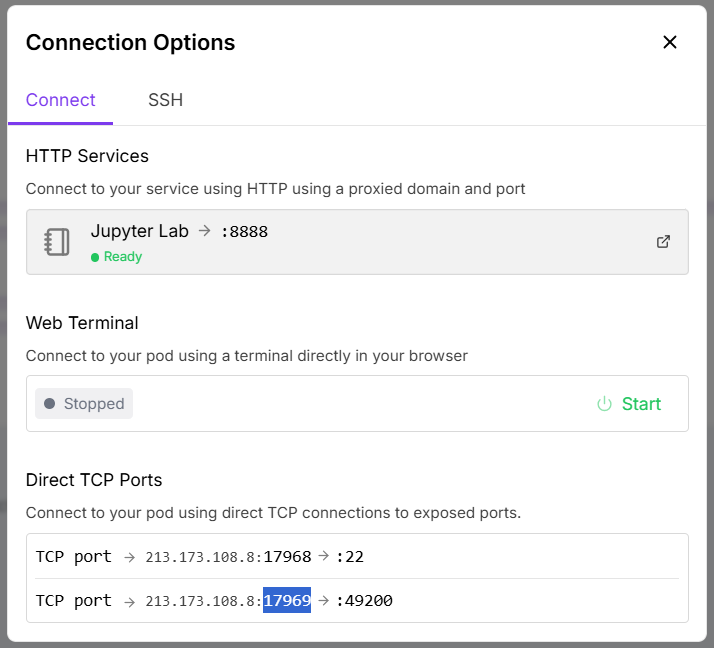
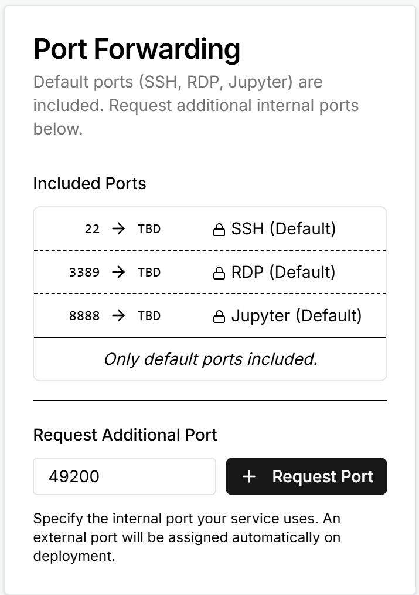
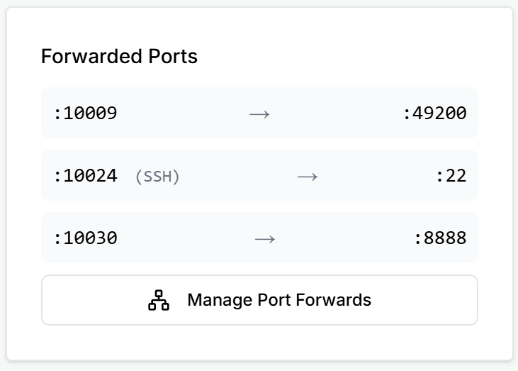
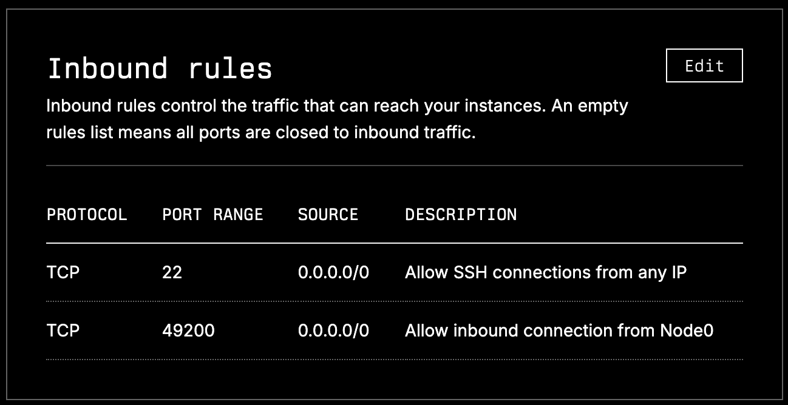

# Network Configuration Guide

This guide provides instructions for configuring port 49200 to be accessible for external connections across various cloud compute providers and personal networks.

## AWS
1. Navigate to your EC2 instance and click on the Security Group attached to it (found under the Security tab)
2. Click "Inbound rules" → "Edit inbound rules"
3. Click "Add rule" and configure:
   - **Type:** Custom TCP
   - **Port range:** 49200
   - **Source:** 0.0.0.0/0 (to allow traffic from any source)



## Google Cloud Platform (GCP)
1. Go to "VPC network" → "Firewall" → "Create firewall rule"
2. Configure the rule:
   - **Target:** Choose "All instances in the network" or "Specified target tags" and specify your instance
   - **Source IPv4 ranges:** 0.0.0.0/0
   - **Protocols and ports:** Select "Specified protocols and ports"
   - **TCP:** 49200



## RunPod
RunPod assigns random external port mappings, so you need to configure port forwarding:

1. After deploying a Pod, click the three horizontal lines (Pod Settings) → "Edit Pod"



2. Under "Expose TCP Ports" add `49200` and save (this will restart the Pod)



3. Once restarted, click "Connect" to see the external port mapping for internal port 49200. In the example below, the external port is 17969.



4. Use these flags when running generate_script.py (see **Changing exposed port** section in README for details):

```bash
--host_port 49200     # The internal port the library will listen on
--announce_port 17969 # The external port other peers will connect to
```

## Tensordock
### Distributed Compute
When provisioning an instance using the Distributed Compute option, Tensordock allows you to request a specific internal port and then assigns a nrandom external port mapping to that port, so you need to configure port forwarding:

1. During provisioning setup, under the Port Forwarding section → "Request Port" and choose `49200`:



2. Once deployed, note the randomly assigned external port:



3. Use these flags when running generate_script.py (see **Changing exposed port** section in README for details). `--announce_port` should specify your randomly assigned external port:

```bash
--host_port 49200     # The internal port the library will listen on
--announce_port 10009 # The external port other peers will connect to
```

## Lambda Labs
1. Navigate to the Firewall page in your Lambda Cloud dashboard
2. Click "Edit" in the Inbound Rules section
3. Configure the new rule:
   - **Rule type:** Custom TCP
   - **Port range:** 49200
   - **Source:** 0.0.0.0/0 (to allow traffic from any source)



## Personal Computer

Set up your firewall to allow traffic from the outside world to the port 49200/tcp.

If you have a router, set it up to allow connections from the outside world (port 49200/tcp) to your computer.

## WSL

If you're using Windows with WSL 2, you'll need to configure port forwarding:

1. **Create WSL configuration file:**
   Create a `.wslconfig` file in your Windows user home directory (e.g., `C:\Users\YourUsername\.wslconfig`) with the following content:
   ```
   [wsl2]
   localhostforwarding=true
   ```

2. **Configure port proxy (run PowerShell as Administrator):**
   
   Find your WSL container IP:
   ```powershell
   ((wsl hostname -I) -split " ")[0]
   ```
   
   Add the port proxy (replace `<wsl_ip>` with the IP from the previous command):
   ```powershell
   netsh interface portproxy add v4tov4 listenport=49200 listenaddress=0.0.0.0 connectport=49200 connectaddress=<wsl_ip>
   ```
   
   Open the firewall for the port:
   ```powershell
   netsh advfirewall firewall add rule name="node0" dir=in action=allow protocol=TCP localport=49200
   ```

3. **If you have a router**, set it up to allow connections from the outside world (port 49200/tcp) to your computer.
4. **Restart your computer** to apply the changes.
